# 🎮 One-Day Hackathon: Build It. Level Up. Own the Stage!

## Tutorial Game Construct 2 - Edukasi Lingkungan

Kumpulan tutorial membuat game dengan tema lingkungan dan konteks Indonesia menggunakan Construct 2.

---

## 📖 Daftar Istilah

| Istilah | Arti |
|---------|------|
| **Sprite** | Gambar/objek yang bisa bergerak di game |
| **Tilemap** | Objek untuk menggambar level dari tile/kotak-kotak kecil |
| **Layout** | Halaman atau layar game (seperti level) |
| **Behavior** | Perilaku otomatis yang ditambahkan ke objek |
| **Event Sheet** | Tempat menulis logika/aturan game |
| **Event** | Kondisi/kejadian yang memicu aksi |
| **Action** | Aksi yang dilakukan saat event terjadi |
| **Variable** | Tempat menyimpan angka atau teks (seperti skor) |
| **Collision** | Saat dua objek bertabrakan/bersentuhan |

---

## 🌲 Misi 1: Petualangan Hutan Kalimantan

**Jenis Game:** Platformer (lompat-lompatan)  
**Tema:** Menjelajahi hutan dan menghindari kebakaran  
**Tujuan:** Karakter harus sampai ke pos aman sebelum terjebak api hutan!

---

### 🛠️ Langkah 1: Buat Project Baru

1. Buka **Construct 2** dan klik **New Project**


2. Atur ukuran layar (**Layout Size**): **1280 x 720**
   - Klik pada **Layout 1** di panel Projects (kanan)
   - Lihat panel **Properties** (kiri), cari **Layout Size**

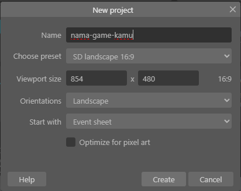

   > *Catatan: Viewport (ukuran layar) tidak harus sama persis seperti di gambar. Kamu bebas menentukan ukuran sesuai kebutuhan.*

3. Tambahkan gambar latar belakang (hutan/forest)
4. Buat **Layer** baru untuk tampilan skor dan timer
   - Klik tab **Layers** di panel kanan
   - Klik icon **+** untuk tambah layer baru


   > *Catatan: Kamu bisa menggunakan layer terpisah untuk memisahkan background dengan objek game utama.*

---

### 🎮 Langkah 2: Membuat Karakter Pemain

#### A. Tambah Gambar Karakter

1. Klik kanan di Layout → **Insert New Object** → pilih **Sprite** → beri nama `Player`

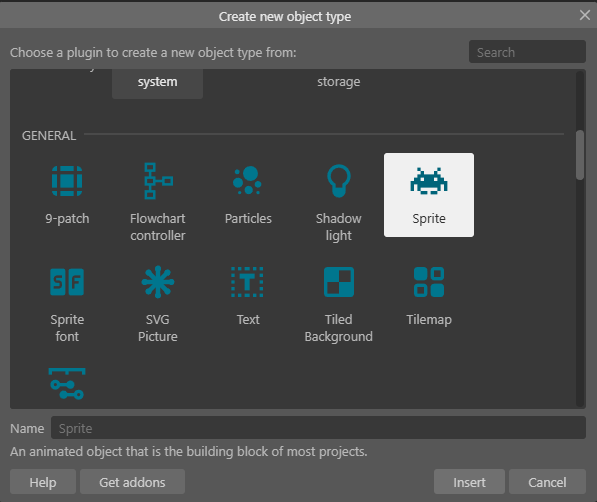

   > *Catatan: Setelah memilih Sprite, klik di area layout untuk menempatkannya. Image Editor akan terbuka otomatis.*

2. Gambar karakter atau masukkan gambar dari file (klik folder icon di Image Editor)

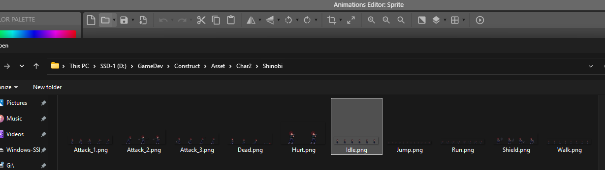

**Jika gambar kamu berupa sprite sheet (animasi):**


1. Klik kanan pada panel frame (bagian bawah) → pilih **Import frames → From sprite strip**

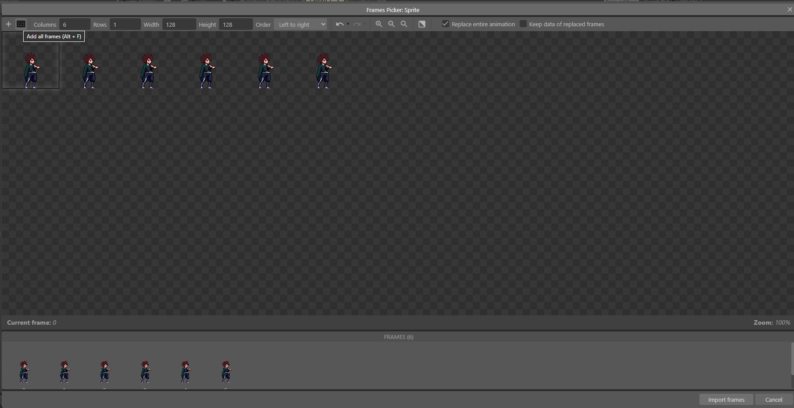

2. Atur jumlah kolom sesuai sprite sheet, lalu klik **Add all frames**

   > *Tips: Kamu juga bisa menambahkan animasi lain seperti "Run", "Walk", "Jump", dll dengan cara yang sama.*


3. Klik kanan pada `Player` di Layout → **Behaviors** → **Add** → pilih **Platform**

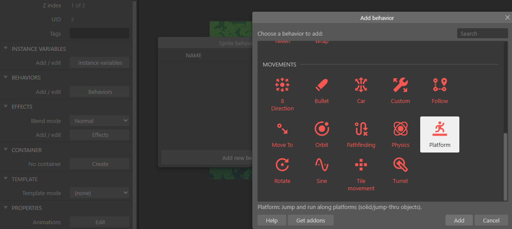

   > *Behavior "Platform" membuat karakter bisa jalan dan lompat otomatis, Tambahkan Juga Behavior "Scroll-To" agar kamera mengikuti Pemain*

#### B. Buat Tanah dengan Tilemap

1. **Insert New Object** → **Tilemap** → beri nama `Ground`


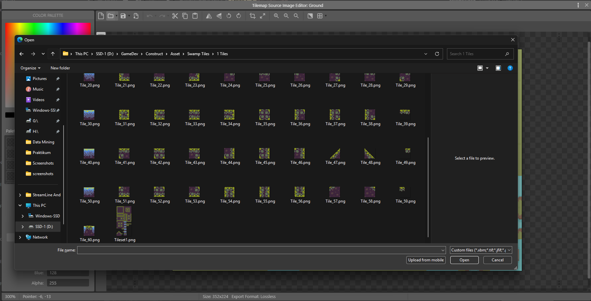

2. Double-click Tilemap untuk buka **Tilemap Editor**
3. Load tileset gambar (klik folder icon) - gunakan tileset tanah/rumput
4. Gambar platform dengan klik dan drag di layout


   > *Catatan: Setelah tileset berhasil di-import, kamu bisa mulai menggambar level dengan memilih tile yang tersedia.*

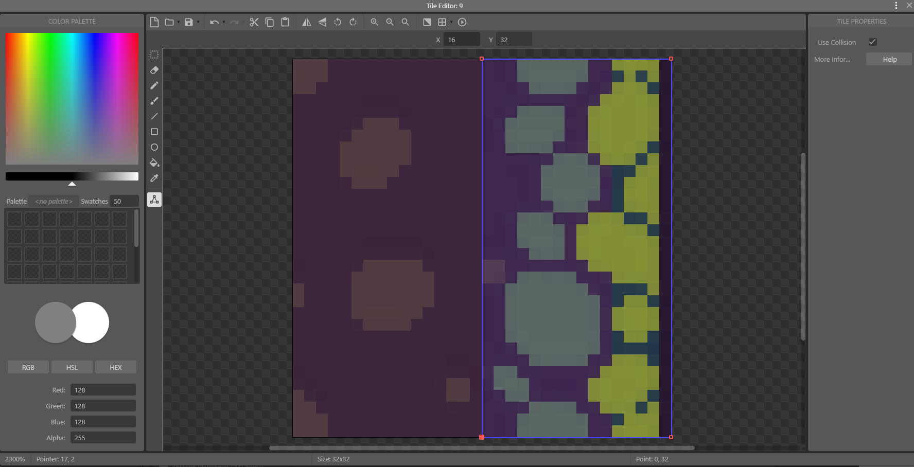

   > *Penting: Atur collision setiap tile agar sesuai dengan bentuk gambar. Double-click pada tile untuk mengedit collision polygon. Contoh: jika tile berukuran 32x32 px, titik tengahnya adalah (16, 16).*


 

   > *Behavior "Solid" membuat objek tidak bisa ditembus. Alternatif: gunakan "Jump-thru" jika ingin pemain bisa lompat menembus platform dari bawah.*

   > *Tips: Tekan F5 untuk test game dan cek apakah platform sudah berfungsi dengan benar.*

#### C. Buat Pos Aman (Garis Finish)

1. **Insert New Object** → **Sprite** → beri nama `SafeZone`
2. Letakkan di ujung kanan layout

   > *Tips: Kamu bisa menggunakan asset checkpoint yang ada di folder Asset.*

---

### 🔥 Langkah 3: Rintangan - Api Menyebar

1. **Insert New Object** → **Sprite** → beri nama `Fire`
2. Tambah **Behavior** → pilih **Platform**
   > *Behavior "Platform" membuat api mengikuti gravitasi dan berdiri di atas tanah*
3. Atur properti Platform:
   - **Max Speed**: 100 (kecepatan horizontal)
   - **Default controls**: **No** (agar tidak dikontrol keyboard)
4. Letakkan `Fire` di atas tilemap `Ground`

   > *Tips: Pastikan tilemap Ground sudah memiliki behavior "Solid" agar api bisa berdiri di atasnya*

#### Event Sheet:

Buka **Event Sheet 1** (double-click di panel Projects)

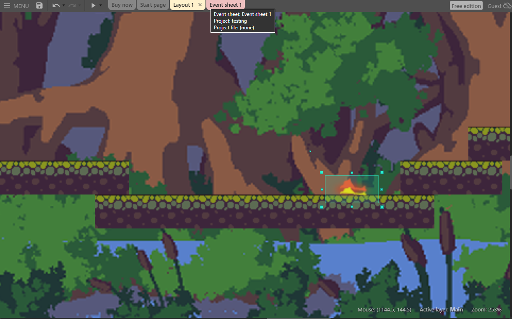

Klik kanan di area kosong → **Add event** untuk menambah event baru

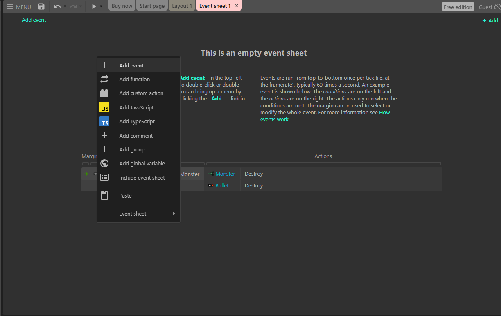

```
Event: System → Every tick                  (Setiap saat)
Action: Fire → Simulate control "Right"     (Api bergerak ke kanan mengikuti tanah)

Event: Fire → Platform → Is by wall         (Api menabrak dinding/rintangan)
       Fire → Platform → Is on floor        (Dan sedang di tanah)
Action: Fire → Simulate control "Jump"      (Lompat otomatis)

Event: Player → On collision with Fire      (Pemain menyentuh api)
Action: System → Restart layout             (Mulai ulang level)
```

> *Catatan: Dengan menggunakan Platform behavior + Simulate control, api akan bergerak horizontal sambil tetap mengikuti kontur tanah. Kondisi "Is by wall" membuat api otomatis lompat saat menabrak rintangan!*

---

### 🕳️ Langkah 4: Jurang (Zona Mati)

1. Buat **Sprite** bernama `DeathZone` di bawah layout (tidak terlihat pemain)

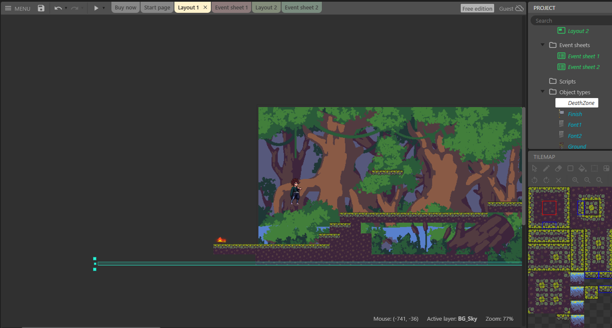
> *Catatan: Kamu dapat membuat DeathZone dengan memilih sprite transparan dan bentuk menjadi persegi panjang dan letakan di bagian bawah layout*
#### Event Sheet:

```
Event: Player → On collision with DeathZone   (Pemain jatuh ke jurang)
Action: System → Restart layout               (Mulai ulang level)
```

---

### 🏆 Langkah 5: Kondisi Menang

#### Event Sheet:

```
Event: Player → On collision with SafeZone    (Pemain sampai pos aman)
Action: System → Go to layout "WinScreen"     (Pindah ke halaman menang)
```

---

## 🚀 TANTANGAN TAMBAHAN - Tingkat Lanjut

### ⚡ Tantangan 1: Kamera Bergerak & Api Mengejar

**Tujuan:** Kamera bergerak otomatis, pemain harus tetap di layar atau terbakar!

1. Buat **Sprite** bernama `FireWall` di sisi kiri layar (dinding api)
2. Tambah **Behavior** → **Anchor** (agar mengikuti kamera)

#### Event Sheet:

```
Event: System → Every tick                    (Setiap saat, terus menerus)
Action: System → Scroll to X: ScrollX + 2     (Geser kamera ke kanan)

Event: Player.X < ScrollX - 300               (Pemain tertinggal di kiri)
Action: System → Restart layout
        Text → Set text to "Terbakar Api Hutan!"
```

---

### 🎭 Tantangan 2: Kumpulkan Air

**Tujuan:** Kumpulkan semua ember air untuk memadamkan api di garis finish!

1. Buat **Sprite** bernama `Water`
2. Buat **Global Variable** → `WaterCollected = 0`
   - Klik kanan di **Event Sheet** → **Add global variable**

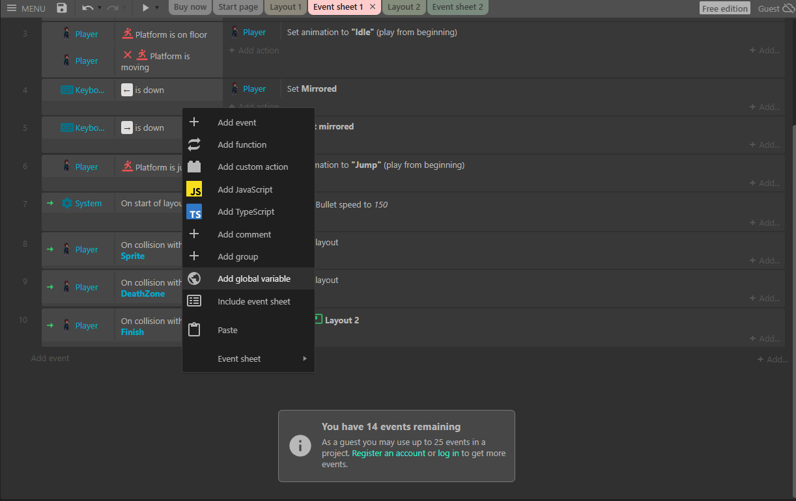

3. Buat **Global Variable** → `TotalWater = 5`

#### Event Sheet:

```
Event: Player → On collision with Water       (Pemain mengambil air)
Action: Water → Destroy                       (Hapus air)
        System → Add 1 to WaterCollected      (Tambah penghitung)
        Audio → Play "pickup_sound"           (Mainkan suara)

Event: System → WaterCollected = TotalWater   (Semua air terkumpul)
Action: SafeZone → Set Visible to True        (Tampilkan pos aman)
        Text → Set text to "Api Padam! Jalan Terbuka!"

Event: Player → On collision with SafeZone    (Pemain ke pos aman)
       System → WaterCollected < TotalWater   (Tapi air belum lengkap)
Action: Text → Set text to "Kumpulkan semua air dulu!"
```

---

### 🦧 Tantangan 3: Selamatkan Orangutan

**Tujuan:** Bantu orangutan mencapai pos aman!

1. Buat **Sprite** bernama `Orangutan`
2. Buat **Instance Variable** di Orangutan: `IsRescued = False`
   - Klik pada Orangutan → di panel **Properties** (kiri) → klik **Instance variables** → **Add**


#### Event Sheet:

```
Event: Player → On collision with Orangutan   (Pemain menyentuh orangutan)
       Orangutan → IsRescued = False          (Yang belum diselamatkan)
Action: Orangutan → Set IsRescued to True     (Tandai sudah diselamatkan)
        Orangutan → Pin to Player             (Tempelkan ke pemain)
        Text → Set text to "Orangutan bergabung!"

Event: Orangutan → IsRescued = True           (Orangutan yang sudah diselamatkan)
       Player → On collision with SafeZone    (Sampai di pos aman)
Action: System → Add 100 to Score             (Tambah skor)
        Text → Set text to "Orangutan Selamat! +100 Poin"
```
---

## 📚 Panduan Umum Construct 2

### 🎨 Behavior yang Sering Digunakan

| Behavior | Fungsi | Digunakan di |
|----------|--------|--------------|
| **Platform** | Karakter bisa jalan & lompat | Misi 1 |
| **Tilemap** | Menggambar level dari tile | Misi 1 |
| **Bullet** | Objek bergerak otomatis lurus | Misi 1, 2, 3 |
| **Solid** | Objek tidak bisa ditembus | Semua Misi |
| **Drag & Drop** | Objek bisa digeser pakai mouse | Misi 3 |
| **Pin** | Objek menempel ke objek lain | Misi 1 (NPC) |
| **Anchor** | Objek tetap di posisi layar | Misi 1 (UI) |

---

## 🔧 Tips Mencari Kesalahan (Debugging)

1. **Tampilkan nilai variable** untuk cek apakah benar:
   ```
   Text → Set text to "Score: " & Score
   ```

2. **Tekan F12** di browser untuk lihat pesan error di Console

3. **Tekan F5** untuk preview/test game langsung di browser

4. **Debug Mode**: Layout → Preview → Debug untuk lihat semua variable secara real-time

---

## 📝 Catatan Penting

- **Software:** Construct 2 (Desktop) atau Construct 3 (Online)
- Setiap misi punya **Dasar** dan **Tantangan Tambahan**
- Jangan takut bereksperimen dengan behavior dan event sheet!

---

## 🔗 Link Berguna

| Link | Keterangan |
|------|------------|
| [Construct 2 Official](https://www.scirra.com/construct2) | Download software |
| [Construct 3 Online](https://editor.construct.net/) | Versi online (gratis terbatas) |
| [Construct Manual](https://www.construct.net/en/make-games/manuals/construct-3) | Panduan lengkap |
| [Kenney Assets](https://kenney.nl/) | Gambar game gratis |
| [OpenGameArt](https://opengameart.org/) | Asset game gratis |
| [Freesound](https://freesound.org/) | Efek suara gratis |

---

## 🎯 Tantangan Ekstra

| Misi | Tantangan |
|------|-----------|
| Misi 1 | Buat sistem **stamina** (pemain tidak bisa lompat terus-menerus) |
| Misi 2 | Tambahkan **koridor TransJakarta** berbeda dengan rute berbeda |
| Misi 3 | Buat **siang/malam** (panel hanya aktif saat siang) |

---


**Build It. Level Up. Own the Stage! 🎮🔥**
