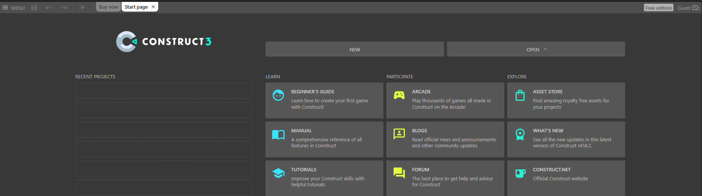
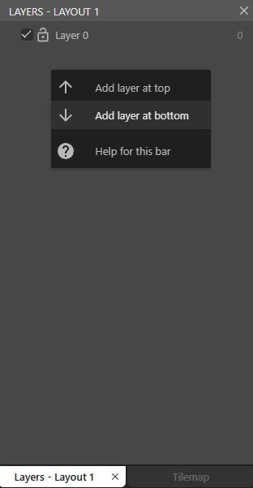
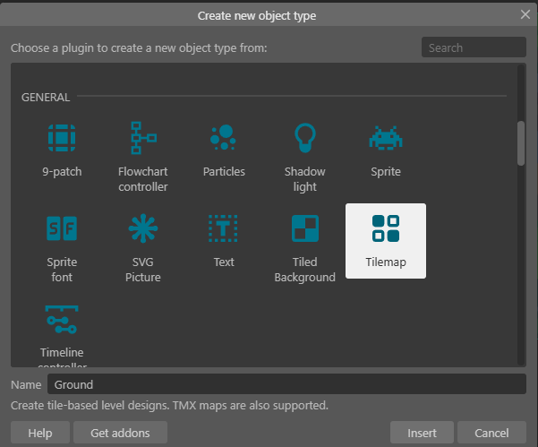
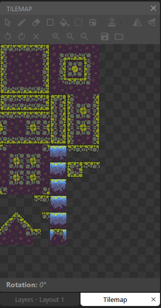

# 🎮 One-Day Hackathon: Build It. Level Up. Own the Stage!

## Tutorial Game Construct 2 - Edukasi Lingkungan

Kumpulan tutorial membuat game dengan tema lingkungan dan konteks Indonesia menggunakan Construct 2.

---

## 📖 Daftar Istilah

| Istilah | Arti |
|---------|------|
| **Sprite** | Gambar/objek yang bisa bergerak di game |
| **Tilemap** | Objek untuk menggambar level dari tile/kotak-kotak kecil |
| **Layout** | Halaman atau layar game (seperti level) |
| **Behavior** | Perilaku otomatis yang ditambahkan ke objek |
| **Event Sheet** | Tempat menulis logika/aturan game |
| **Event** | Kondisi/kejadian yang memicu aksi |
| **Action** | Aksi yang dilakukan saat event terjadi |
| **Variable** | Tempat menyimpan angka atau teks (seperti skor) |
| **Collision** | Saat dua objek bertabrakan/bersentuhan |

---

## �️ Misi 1: Petualangan Hutan Kalimantan

**Jenis Game:** Platformer (lompat-lompatan)  
**Tema:** Menjelajahi hutan dan menghindari kebakaran  
**Tujuan:** Karakter harus sampai ke pos aman sebelum terjebak api hutan!

---

### 🛠️ Langkah 1: Buat Project Baru

1. Buka **Construct 2** dan klik **New Project**



2. Atur ukuran layar (**Layout Size**): **1280 x 720**
   - Klik pada **Layout 1** di panel Projects (kanan)
   - Lihat panel **Properties** (kiri), cari **Layout Size**


3. Tambahkan gambar latar belakang (hutan/forest)
4. Buat **Layer** baru untuk tampilan skor dan timer
   - Klik tab **Layers** di panel kanan
   - Klik icon **+** untuk tambah layer baru



---

### 🎮 Langkah 2: Membuat Karakter Pemain

#### A. Tambah Gambar Karakter

1. Klik kanan di Layout → **Insert New Object** → pilih **Sprite** → beri nama `Player`


2. Gambar karakter atau masukkan gambar dari file (klik folder icon di Image Editor)


3. Klik kanan pada `Player` di Layout → **Behaviors** → **Add** → pilih **Platform**


   > *Behavior "Platform" membuat karakter bisa jalan dan lompat otomatis*

#### B. Buat Tanah dengan Tilemap

1. **Insert New Object** → **Tilemap** → beri nama `Ground`



2. Double-click Tilemap untuk buka **Tilemap Editor**
3. Load tileset gambar (klik folder icon) - gunakan tileset tanah/rumput
4. Gambar platform dengan klik dan drag di layout



5. Klik kanan pada `Ground` → **Behaviors** → **Add** → pilih **Solid**
   > *Behavior "Solid" membuat objek tidak bisa ditembus*

#### C. Buat Pos Aman (Garis Finish)

1. **Insert New Object** → **Sprite** → beri nama `SafeZone`
2. Letakkan di ujung kanan layout

---

### 🔥 Langkah 3: Rintangan - Api Menyebar

1. **Insert New Object** → **Sprite** → beri nama `Fire`
2. Tambah **Behavior** → pilih **Bullet**
   > *Behavior "Bullet" membuat objek bergerak otomatis ke satu arah*
3. Atur **Speed** (kecepatan): 150

#### Event Sheet:

Buka **Event Sheet 1** (double-click di panel Projects)


Klik kanan di area kosong → **Add event** untuk menambah event baru


```
Event: System → On start of layout          (Saat game dimulai)
Action: Fire → Set Bullet Speed to 150      (Atur kecepatan api)

Event: Player → On collision with Fire      (Pemain menyentuh api)
Action: System → Restart layout             (Mulai ulang level)
```

---

### 🕳️ Langkah 4: Jurang (Zona Mati)

1. Buat **Sprite** bernama `DeathZone` di bawah layout (tidak terlihat pemain)

#### Event Sheet:

```
Event: Player → On collision with DeathZone   (Pemain jatuh ke jurang)
Action: System → Restart layout               (Mulai ulang level)
```

---

### 🏆 Langkah 5: Kondisi Menang

#### Event Sheet:

```
Event: Player → On collision with SafeZone    (Pemain sampai pos aman)
Action: System → Go to layout "WinScreen"     (Pindah ke halaman menang)
```

---

## 🚀 TANTANGAN TAMBAHAN - Tingkat Lanjut

### ⚡ Tantangan 1: Kamera Bergerak & Api Mengejar

**Tujuan:** Kamera bergerak otomatis, pemain harus tetap di layar atau terbakar!

1. Buat **Sprite** bernama `FireWall` di sisi kiri layar (dinding api)
2. Tambah **Behavior** → **Anchor** (agar mengikuti kamera)

#### Event Sheet:

```
Event: System → Every tick                    (Setiap saat, terus menerus)
Action: System → Scroll to X: ScrollX + 2     (Geser kamera ke kanan)

Event: Player.X < ScrollX - 300               (Pemain tertinggal di kiri)
Action: System → Restart layout
        Text → Set text to "Terbakar Api Hutan!"
```

---

### 🎭 Tantangan 2: Kumpulkan Air

**Tujuan:** Kumpulkan semua ember air untuk memadamkan api di garis finish!

1. Buat **Sprite** bernama `Water`
2. Buat **Global Variable** → `WaterCollected = 0`
   - Klik kanan di **Event Sheet** → **Add global variable**


3. Buat **Global Variable** → `TotalWater = 5`

#### Event Sheet:

```
Event: Player → On collision with Water       (Pemain mengambil air)
Action: Water → Destroy                       (Hapus air)
        System → Add 1 to WaterCollected      (Tambah penghitung)
        Audio → Play "pickup_sound"           (Mainkan suara)

Event: System → WaterCollected = TotalWater   (Semua air terkumpul)
Action: SafeZone → Set Visible to True        (Tampilkan pos aman)
        Text → Set text to "Api Padam! Jalan Terbuka!"

Event: Player → On collision with SafeZone    (Pemain ke pos aman)
       System → WaterCollected < TotalWater   (Tapi air belum lengkap)
Action: Text → Set text to "Kumpulkan semua air dulu!"
```

---

### 🦧 Tantangan 3: Selamatkan Orangutan

**Tujuan:** Bantu orangutan mencapai pos aman!

1. Buat **Sprite** bernama `Orangutan`
2. Buat **Instance Variable** di Orangutan: `IsRescued = False`
   - Klik pada Orangutan → di panel **Properties** (kiri) → klik **Instance variables** → **Add**


#### Event Sheet:

```
Event: Player → On collision with Orangutan   (Pemain menyentuh orangutan)
       Orangutan → IsRescued = False          (Yang belum diselamatkan)
Action: Orangutan → Set IsRescued to True     (Tandai sudah diselamatkan)
        Orangutan → Pin to Player             (Tempelkan ke pemain)
        Text → Set text to "Orangutan bergabung!"

Event: Orangutan → IsRescued = True           (Orangutan yang sudah diselamatkan)
       Player → On collision with SafeZone    (Sampai di pos aman)
Action: System → Add 100 to Score             (Tambah skor)
        Text → Set text to "Orangutan Selamat! +100 Poin"
```


---

## 🚌 Misi 2: Juragan TransJakarta

**Jenis Game:** Pengatur Lalu Lintas  
**Tema:** Kemacetan Jakarta & disiplin berlalu lintas  
**Tujuan:** Kendalikan lalu lintas agar bus tidak menabrak pengendara liar!

---

### 🛠️ Langkah 1: Buat Layout

1. Ukuran layar (**Layout Size**): **1920 x 1080**
2. Gambar latar: Jalan dengan jalur busway (garis kuning)
3. Buat **3 jalur**: Kiri (motor), Tengah (busway), Kanan (motor)

---

### 🚍 Langkah 2: Bus yang Bergerak

1. **Insert New Object** → **Sprite** → beri nama `Bus`
2. Tambah **Behavior** → **Bullet**
3. Atur **Speed**: 150

#### Event Sheet:

```
Event: System → On start of layout            (Saat game dimulai)
Action: Bus → Set Bullet enabled              (Aktifkan gerakan)
        Bus → Set Bullet Speed to 150         (Atur kecepatan)
```

---

### 🏍️ Langkah 3: Motor yang Muncul Acak

1. Buat **Sprite** → `Motorcycle`
2. Tambah **Behavior** → **Bullet**

#### Event Sheet:

```
Event: System → Every 2 seconds               (Setiap 2 detik)
Action: System → Create object Motorcycle     (Buat motor baru)
        at (X: -100, Y: choose(200, 400, 600))  (Posisi acak)
        Motorcycle → Set Bullet Speed to random(100, 200)

Event: Motorcycle.X > LayoutWidth + 100       (Motor keluar layar kanan)
Action: Motorcycle → Destroy                  (Hapus motor)
```

---

### 🚦 Langkah 4: Palang Pintu (Klik untuk Buka/Tutup)

1. Buat **Sprite** → `TrafficGate`
2. Buat **Instance Variable**: `IsClosed = False`

#### Event Sheet:

```
Event: Mouse → On click on TrafficGate        (Klik palang)
       TrafficGate → IsClosed = False         (Saat terbuka)
Action: TrafficGate → Set IsClosed to True    (Tutup palang)
        TrafficGate → Set animation to "closed"
       
Event: Mouse → On click on TrafficGate        (Klik palang)
       TrafficGate → IsClosed = True          (Saat tertutup)
Action: TrafficGate → Set IsClosed to False   (Buka palang)
        TrafficGate → Set animation to "open"

Event: Motorcycle → Is overlapping TrafficGate  (Motor di palang)
       TrafficGate → IsClosed = True            (Palang tertutup)
Action: Motorcycle → Set Bullet Speed to 0      (Motor berhenti)

Event: Motorcycle → Is overlapping TrafficGate  (Motor di palang)
       TrafficGate → IsClosed = False           (Palang terbuka)
Action: Motorcycle → Set Bullet Speed to 150    (Motor jalan lagi)
```

---

### 💥 Langkah 5: Tabrakan = Game Over

#### Event Sheet:

```
Event: Bus → On collision with Motorcycle     (Bus nabrak motor)
Action: System → Restart layout               (Mulai ulang)
        Audio → Play "crash_sound"            (Suara tabrakan)
        Text → Set text to "TABRAKAN!"
```

---

## 🚀 TANTANGAN TAMBAHAN - Tingkat Lanjut

### 🚏 Tantangan 1: Halte Bus

**Tujuan:** Bus harus berhenti 3 detik di halte untuk menaikkan penumpang!

1. Buat **Sprite** → `BusStop`
2. Buat **Instance Variable** di Bus: `IsAtStop = False`

#### Event Sheet:

```
Event: Bus → Is overlapping BusStop           (Bus di halte)
       Bus → IsAtStop = False                 (Belum berhenti)
Action: Bus → Set IsAtStop to True
        Bus → Set Bullet Speed to 0           (Berhenti)
        System → Wait 3 seconds               (Tunggu 3 detik)
        Bus → Set Bullet Speed to 150         (Jalan lagi)
        Bus → Set IsAtStop to False
        System → Add 10 to Score
        Text → Set text to "Penumpang Naik! +10"
```

---

### 🌧️ Tantangan 2: Efek Hujan

**Tujuan:** Saat hujan, semua kendaraan melambat!

1. Buat **Particles** untuk efek hujan
2. Buat **Global Variable**: `IsRaining = False`

#### Event Sheet:

```
Event: System → Every 15 seconds              (Setiap 15 detik)
Action: System → Toggle IsRaining             (Ganti status hujan)
       
Event: System → IsRaining = True              (Saat hujan)
Action: Bus → Set Bullet Speed to 100         (Bus melambat)
        Motorcycle → Set Bullet Speed to 80   (Motor melambat)
        Particles → Set visible               (Tampilkan hujan)
       
Event: System → IsRaining = False             (Saat tidak hujan)
Action: Bus → Set Bullet Speed to 150         (Kembali normal)
        Motorcycle → Set Bullet Speed to 150
        Particles → Set invisible             (Sembunyikan hujan)
```

---

### 🚔 Tantangan 3: Tilang Elektronik

**Tujuan:** Klik motor yang masuk jalur busway untuk tilang!

1. Buat **Sprite** → `BuswayZone` (zona jalur busway, invisible)

#### Event Sheet:

```
Event: Motorcycle → Is overlapping BuswayZone   (Motor di jalur busway)
       Mouse → On click on Motorcycle           (Diklik)
Action: Motorcycle → Destroy                    (Hapus motor)
        System → Add 5 to Score
        Audio → Play "ticket_sound"
        Text → Set text to "E-Tilang! +5"
```


---

## ☀️ Misi 3: Energi Surya Pelosok Desa

**Jenis Game:** Puzzle (teka-teki)  
**Tema:** Listrik untuk desa terpencil dengan panel surya  
**Tujuan:** Putar cermin agar cahaya matahari mengenai panel surya!

---

### 🛠️ Langkah 1: Buat Layout

1. Gambar latar: Pemandangan desa (rumah tanpa listrik)
2. Buat **Sprite** → `Sun` (matahari di kiri atas)
3. Buat **Sprite** → `Mirror` (cermin yang bisa diputar)
4. Buat **Sprite** → `SolarPanel` (target)
5. Buat **Sprite** → `House` (dengan 2 animasi: lampu mati & nyala)

---

### 💡 Langkah 2: Membuat Sinar Cahaya

1. Buat **Sprite** kecil → `LightRay` (titik cahaya)
2. Tambah **Behavior** → **Bullet**

#### Event Sheet:

```
Event: System → Every 0.1 seconds             (Setiap 0.1 detik)
Action: System → Create object LightRay at Sun  (Buat sinar dari matahari)
        LightRay → Set Bullet Speed to 500      (Kecepatan tinggi)
        LightRay → Set Bullet Angle to 0        (Arah ke kanan)
```

---

### 🪞 Langkah 3: Cermin yang Bisa Diputar

1. Pilih `Mirror` → Tambah **Behavior** → **Drag & Drop** (opsional)

#### Event Sheet:

```
Event: Mouse → On click on Mirror             (Klik cermin)
Action: Mirror → Rotate 45 degrees clockwise  (Putar 45 derajat)

// Alternatif: pakai keyboard
Event: Keyboard → On R pressed                (Tekan tombol R)
       Mouse cursor → Is over Mirror          (Mouse di atas cermin)
Action: Mirror → Rotate 45 degrees
```

---

### 🔆 Langkah 4: Pantulan Cahaya

#### Event Sheet:

```
Event: LightRay → On collision with Mirror    (Sinar kena cermin)
Action: LightRay → Set Bullet Angle to Mirror.Angle + 90  (Dipantulkan)
       
Event: LightRay → On collision with SolarPanel  (Sinar kena panel)
Action: LightRay → Destroy                      (Hapus sinar)
        SolarPanel → Set animation to "active"  (Panel aktif)
        House → Set animation to "lights_on"    (Lampu nyala)
        System → Add 100 to Score
        Text → Set text to "Panel Aktif! Listrik Menyala!"
```

---

### 🎯 Langkah 5: Kondisi Menang

Buat **Global Variable**: `HousesPowered = 0` dan `TotalHouses = 3`

#### Event Sheet:

```
Event: SolarPanel → Animation "active" is playing  (Panel sudah aktif)
       SolarPanel → IsPowered = False              (Belum dihitung)
Action: System → Add 1 to HousesPowered            (Tambah penghitung)
        SolarPanel → Set IsPowered to True         (Tandai sudah dihitung)

Event: System → HousesPowered = TotalHouses        (Semua rumah terang)
Action: System → Go to layout "WinScreen"
        Text → Set text to "Semua Rumah Teraliri Listrik!"
```

---

## 🚀 TANTANGAN TAMBAHAN - Tingkat Lanjut

### ☁️ Tantangan 1: Awan Menghalangi

**Tujuan:** Simpan energi di baterai saat ada matahari, pakai saat berawan!

1. Buat **Sprite** → `Cloud` (bergerak horizontal)
2. Buat **Global Variable**: `BatteryCharge = 0` (max 100)

#### Event Sheet:

```
Event: Cloud → Is overlapping Sun             (Awan menutupi matahari)
Action: Sun → Set IsBlocked to True           (Matahari terhalang)

Event: Sun → IsBlocked = False                (Matahari tidak terhalang)
       LightRay → On collision with SolarPanel
Action: System → Add 10 to BatteryCharge      (Isi baterai)
        Text → Set text to "Baterai: " & BatteryCharge & "%"

Event: Sun → IsBlocked = True                 (Matahari terhalang)
       System → Every 1 second                (Setiap detik)
Action: System → Subtract 5 from BatteryCharge  (Baterai berkurang)
       
Event: BatteryCharge <= 0                     (Baterai habis)
Action: House → Set animation to "lights_off" (Lampu mati)
        Text → Set text to "Baterai Habis!"
```

---

### 🔢 Tantangan 2: Batas Cermin

**Tujuan:** Gunakan maksimal 5 cermin untuk menyalakan semua rumah!

Buat **Global Variable**: `MirrorsUsed = 0` dan `MaxMirrors = 5`

#### Event Sheet:

```
Event: System → On start of layout
Action: Text → Set text to "Cermin Tersisa: " & (MaxMirrors - MirrorsUsed)

Event: Mouse → On click (layout)              (Klik di layar)
       System → MirrorsUsed < MaxMirrors      (Cermin masih ada)
Action: System → Create object Mirror at Mouse.X, Mouse.Y
        System → Add 1 to MirrorsUsed

Event: System → MirrorsUsed >= MaxMirrors     (Cermin habis)
Action: Text → Set text to "Cermin Habis! Atur Posisi dengan Bijak!"
```

---

### 🗺️ Tantangan 3: Level Berbeda - Peta Indonesia

**Tujuan:** Setiap pulau = level berbeda dengan tantangan unik!

1. **Level Papua**: Banyak gunung, cermin harus lebih tinggi
2. **Level Jakarta**: Gedung tinggi menghalangi, butuh banyak pantulan
3. **Level Kalimantan**: Hutan lebat, awan sering lewat


---

## 📚 Panduan Umum Construct 2

### 🎨 Behavior yang Sering Digunakan

| Behavior | Fungsi | Digunakan di |
|----------|--------|--------------|
| **Platform** | Karakter bisa jalan & lompat | Misi 1 |
| **Tilemap** | Menggambar level dari tile | Misi 1 |
| **Bullet** | Objek bergerak otomatis lurus | Misi 1, 2, 3 |
| **Solid** | Objek tidak bisa ditembus | Semua Misi |
| **Drag & Drop** | Objek bisa digeser pakai mouse | Misi 3 |
| **Pin** | Objek menempel ke objek lain | Misi 1 (NPC) |
| **Anchor** | Objek tetap di posisi layar | Misi 1 (UI) |

---

## 🔧 Tips Mencari Kesalahan (Debugging)

1. **Tampilkan nilai variable** untuk cek apakah benar:
   ```
   Text → Set text to "Score: " & Score
   ```

2. **Tekan F12** di browser untuk lihat pesan error di Console

3. **Tekan F5** untuk preview/test game langsung di browser

4. **Debug Mode**: Layout → Preview → Debug untuk lihat semua variable secara real-time

---

## 📝 Catatan Penting

- **Target:** Siswa SMP Kelas 8-9 / SMA
- **Software:** Construct 2 (Desktop) atau Construct 3 (Online)
- Setiap misi punya **Dasar** dan **Tantangan Tambahan**
- Jangan takut bereksperimen dengan behavior dan event sheet!

---

## 🔗 Link Berguna

| Link | Keterangan |
|------|------------|
| [Construct 2 Official](https://www.scirra.com/construct2) | Download software |
| [Construct 3 Online](https://editor.construct.net/) | Versi online (gratis terbatas) |
| [Construct Manual](https://www.construct.net/en/make-games/manuals/construct-3) | Panduan lengkap |
| [Kenney Assets](https://kenney.nl/) | Gambar game gratis |
| [OpenGameArt](https://opengameart.org/) | Asset game gratis |
| [Freesound](https://freesound.org/) | Efek suara gratis |

---

## 🎯 Tantangan Ekstra

| Misi | Tantangan |
|------|-----------|
| Misi 1 | Buat sistem **stamina** (pemain tidak bisa lompat terus-menerus) |
| Misi 2 | Tambahkan **koridor TransJakarta** berbeda dengan rute berbeda |
| Misi 3 | Buat **siang/malam** (panel hanya aktif saat siang) |

---

## 🏆 Kriteria Penilaian Hackathon

| Aspek | Bobot | Penjelasan |
|-------|-------|------------|
| **Fungsionalitas** | 40% | Game berjalan tanpa error, semua fitur dasar bekerja |
| **Kreativitas** | 30% | Menambah tantangan tambahan, tampilan menarik |
| **Problem Solving** | 20% | Event sheet rapi dan efisien |
| **Konteks Indonesia** | 10% | Sesuai dengan konteks/tema Indonesia |

---

**Build It. Level Up. Own the Stage! 🎮🔥**
