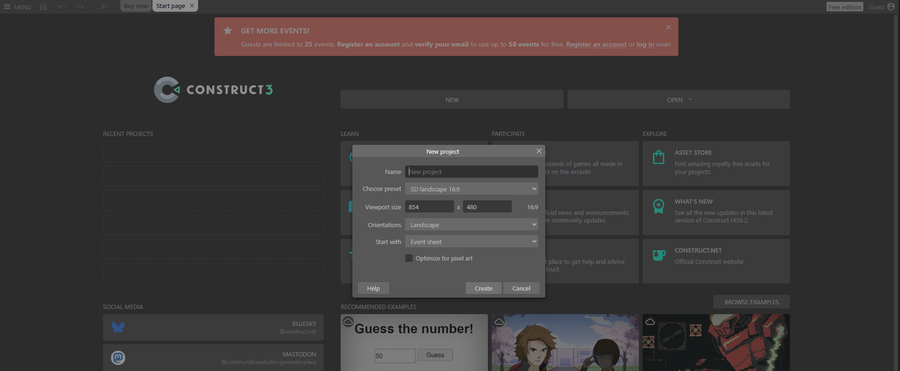
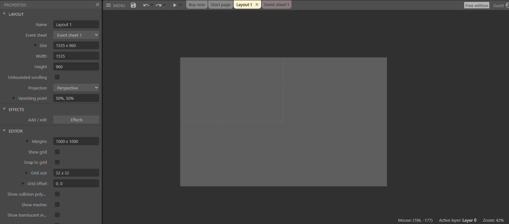
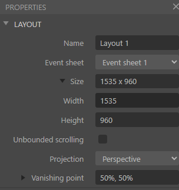
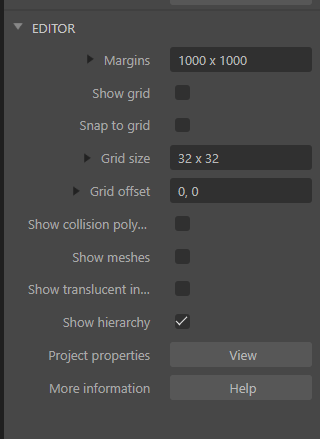
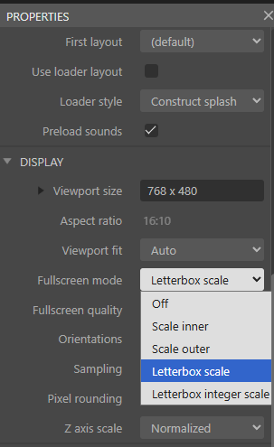
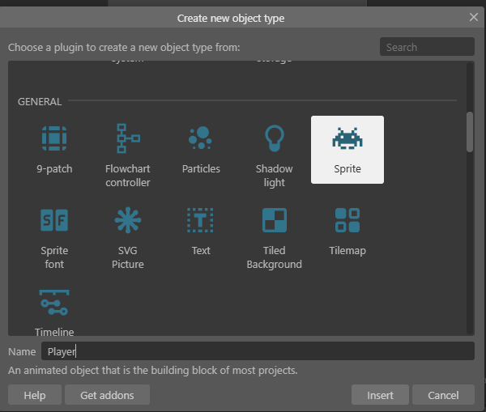
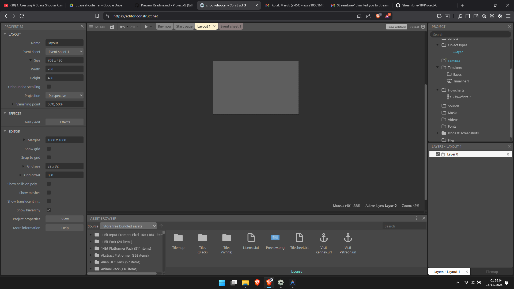
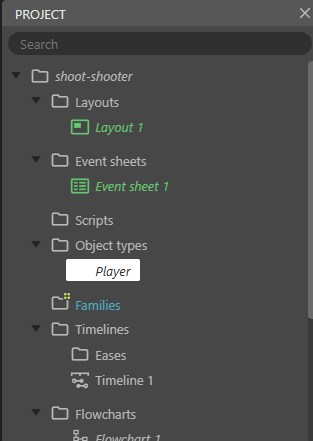

# 🚀 Space Shooter - Cheat Sheet Tutorial

## Tutorial Game Construct 3 - Space Shooter

Panduan singkat membuat game tembak-tembakan pesawat luar angkasa menggunakan Construct 3.
-

## 🎮 Setup Awal

### 🛠️ Langkah 1: Buat Project Baru

1. Buka **Construct 2** dan klik **New Project**
2. Atur ukuran layar (**Layout Size**): **768 x 480** atau sesuai kebutuhan

---

## Mensetting Canvas

### Langkah 2: Setting Canvas
1. **kilk diluar canvas lalu muncul tulisan layout** →  klik size lalu ubah dari`1535 x 960` menjadi `768x480`
2. Jika Berhasil akan muncul ukuran menyesuaikan dengan ukuran pada langkah 1 tadi

3. Jika Sudah berhasil maka selanjut nya dibagian editor lalu klik view

4. setelah itu nanti akan muncul gambar seperti ini,lalu pilih fullscreen mode ganti dari letterbox scale ke letterbox integer scale

<!-- ## Mewarnai background

### Langkah 1: Mewarnai background

1. setelah kita mensetting canvas lalu langkah selanjutnya arahkan cursor kedalam canvas lalu klik kanan `insert new object` → `Tile Background` → lalu ubah nama menjadi `background`

2. setelah itu arahkan cursor kedalam project lalu cari yang namanya `background` lalu klik kanan `upload` → `file` → lalu pilih dari folder yang sudah didownload lalu pilih foto **background** di folder background, bebas mau warna apa, lalu jika sudah maka klik open

3. jika sudah lalu klik lalu open nanti akan muncul disini

4. jika sudah muncul lalu klik x -->
## Membuat Sprite(Player)

### Langkah 3: Buat Player
0. klik canvas nya
1. **Insert New Object** → **Sprite** → beri nama `Player`

2. jika muncul lambang plus dari cursor lalu klik kanvas

3. jika tidak muncul lambang plus bisa lihat di bagian project lalu lihat pada tulisan nama player sampai muncul pop up

4. jika sudah muncul pop up lalu pilih upload dari  **file** → lalu pilih dari folder yang sudah didownload lalu pilih foto **playership** bebas mau warna apa, lalu jika sudah maka klik open

5. pilih salah satu lalu klik open, setlah itu akan muncul tampilan seperti ini, kalau sudah berhasil ke open

6. lalu jika sudah muncul lalu klik tanda X

7. setelah itu lihat dibagian project lalu cari yang namanya player setelah di klik lalu tarik kedalam canvas

## Membuat Laser

### Langkah 4: Buat Laser
1. **Insert New Object** → **Sprite** → beri nama `laser`
2. Gambar laser sama seperti **Player** untuk alur nya, bedanya kita memilih dibagian folder laser(PILIH SALAH SATU SAJA). lalu klik open

3. setelah sudah ditarik ke canvas lalu **Insert New Object** → **Mouse** → beri nama **Mouse**

## Melakukan Integrasi Mouse dan Player

### Langkah 5 : Integrasi

1. agar player bisa bergerak dengan mouse klik **Event Sheet** setelah terbuka maka akan muncul tulisan `add event` klik **add event**

2. pilih **System** lalu cari dipencarian dengan nama `every tick` lalu klik dan pilih next

3. lalu jika sudah muncul every tick lalu pilih tulisan ``add action``

4. setelah itu muncul pop up lalu pilih player lalu pilih ``set x``

5. jika muncul pop ikuti pada gambar ini(INGAT UKURAN HURUF M DAN X HARUS BESAR), lalu jika sudah klik done

6. untuk mengatur player tidak keluar dari canvas kita bisa tekan player dalam canvas , lalu cari behaviors lalu klik add behavior lalu pilih ``destroy outside layout``

7. klik add behaviors lalu cari yang namanya `bound to layout` lalu klik dan pilih add action

8. jika sudah muncul bound to layout lalu klik x(silang)

## Membuat Musuh(ENEMY)

### Langkah 6 : Membuat Musuh

1. klik kanan `insert  new object` → `sprite` → beri nama `enemy`

2. cari folder `enemies` lalu pilih beberapa gambar dengan cara menggunakan `ctrl` di bagian sisi kiri `lalu ditahan` setelah itu pilih beberapa gambar dengan cara mengeklik beberapa gambar lalu jika berhasil maka di bagian **file name** akan muncul tulisan dari gambar yang kita pilih

3. lalu klik open setelah itu jika berhasil akan muncul beberapa gambar, setelah itu cari yang namanya `animation properties` lalu ubah speed dari `5` menjadi `0` lalu klik X(silang)

## Melakukan Integrasi Laser dengan Player

### Langkah 7 : Integrasi Lase dan player agak bergerak berasama

1. masuk ke `event sheet 1` lalu add action dibawah nya gambar player  lalu pilih laser lalu pilih `set y` lalu next

2. lalu ketik parameter `Self.Y - 10` lalu done

## Melakukan Integrasi Laser,player dengan musuh

### Langkah 8 : Membuat enemy bergerak

1. masuk ke `event sheet 1` lalu add action dibawah nya gambar enemy  lalu pilih enemy lalu pilih `set y` lalu next lalu ketik parameter `Self.Y + 3` lalu done

## membuat laser dua arah

### Langkah 9 : Membuat laser dua arah

1. masuk ke `event sheet 1` lalu ``add event`` lalu pilih mouse `mouse is down`

2. lalu klik next lalu pilih `left` lalu done 
3. klik add action dibagian  no 2   

3. lalu pilih system lalu cari yang namanya `create object` setelah itu klik next lalu ikutin arahan dari ss

4. lalu diantara no 2 dan mouse kita klik kanan lalu add -> lalu klik another condition 

5. setelah itu klik `system` lalu cari yang namanya `every x seconds` lalu klik next

6.atur interval lalu done

7. setlah itu klik action lagi di baris nya system pada no 2

8. hampir sama seperti step nomor `3` pilih system `create object` lalu klik next lalu ikutin arahan dari ss

## membuat fungsi untuk laser saat terkena musuh akan hancur

### Langkah 10 : Membuat fungsi untuk laser saat terkena musuh akan hancur

1. masuk ke `event sheet 1` lalu `add event` pilih `laser` lalu pilih `is outside layout` lalu next

2. lalu klik action pada nomor 3 dibagian laser lalu pilih `laser` lalu cari `destroyed` lalu klik next

## membuat musuh berlipat ganda

### Langkah 11 : Membuat musuh berlipat ganda

1. masuk ke `event sheet 1` lalu `add event` lalu pilih system lalu cari `every x seconds` lalu klik next
2. atur interval menjadi `2` lalu klik done

3. dibagian ``no 4`` klik action klik `system` lalu cari `create object` lalu ikuti screenshoot ini

4. lalu klik add action lagi dibawah create object tadi pada nomor `4` 

5. lalu klik `enemy` lalu cari `Set Frame`
 

6. lalu kita setting set frame dengan cara mengetik `Random (3)`. NAH PERLU DIKETAHUI ANGKA `(3)` DISINI ITU TERGANTUNG DARI TEMAN TEMAN MEMILIH GAMBAR ENEMY TADI ADA BERAPA DIBAGIAN BAWAH ANIMASI ENEMY

KARNA SAYA ITU MENGAMBIL GAMBAR ADA 3 JADI KITA PILIH 3 DI BAGIAN `Random (3)` JADI CARA BANYANYA ITU DIBAGIAN GAMBAR ADA `0,1,2` NAH KALAU DARI SISTEM BACANYA ADA `3` KALAU TEMAN TEMAN TULISANYA `0,1,2,3` ITU BACANYA 4

## membuat jika laser terkena musuh akan hancur

### Langkah 12 : Membuat jika laser terkena musuh akan hancur

1. pilih `add event` lalu pilih `laser` lalu pilih `on collision with another object` lalu klik next lalu kita pilih `enemy` untuk kita hancurkan lalu pilih done

2. masih dinomor `5` lalu kita pencet `add action` lalu cari `enemy` lalu pilih `destroy`lalu done

3. setelah itu pilih lagi `add action` dibawahnya `enemy` tadi yang sudah kita pilih nanti tampilanya seperti ini, lalu pilih `laser` lalu pilih `destroy` lalu done

## membuat restart sistem jika player terkena enemy

### Langkah 13 : Membuat restart sistem jika player terkena enemy

1. pilih `add event` lalu pilih `player` lalu pilih `on collision with another object` lalu klik next lalu kita pilih `enemy` lalu klik done. nanti tampilan nya akan berubah menjadi ini

2. masih di nomor `6` lalu kita pencet `add action` lalu cari `system` lalu pilih `restart layout` lalu klik next

3. tampilan semua fungsi seperti ini pada event sheet 1

